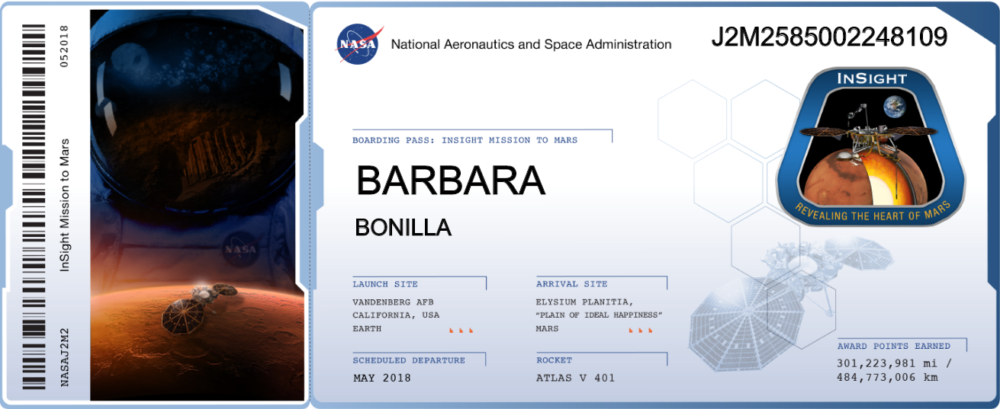
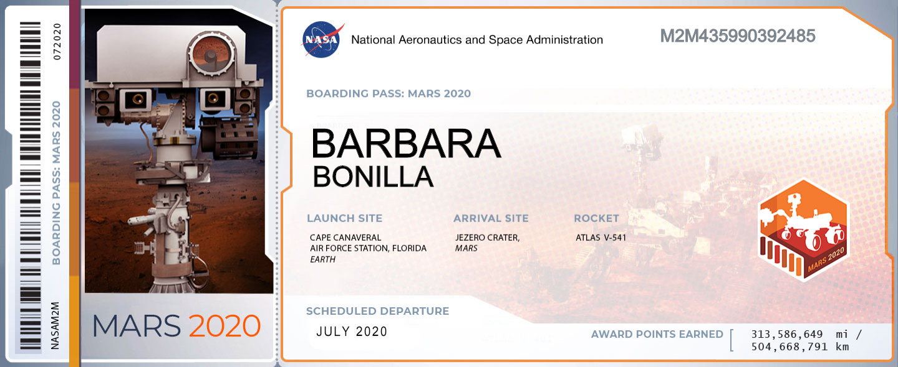

# Frequent Flyer App

A retro-airline "boarding pass" kiosk for NASA's [Astronomy Picture of the Day](https://apod.nasa.gov/apod/) archive. Every day since 1995, NASA has pointed a lens at the cosmos. This app reframes that archive as a passenger's flight log: pick a data, a date range or ask for a random set of "flights", and each entry comes back as a boarding pass you "claim", complete with a barcode stub, a flight code, and a seeded "miles earned" count.

For quicker access, check out the test build on Vercel: **[frequent-flyer-pi.vercel.app](https://frequent-flyer-pi.vercel.app/)**.

## Design inspiration

### The reference boarding passes

These two are real — actual souvenir boarding passes from NASA's [Send Your Name to Mars](https://mars.nasa.gov/participate/send-your-name/insight/faq/) campaigns (InSight and Mars 2020), where your name flies to Mars on a microchip and you get a personalized boarding pass back.

<table>
<tr>
<td width="50%"></td>
<td width="50%"></td>
</tr>
</table>

That's where the boarding-pass concept and the PASSENGER / ORIGIN / LOGGED / MILES field system come from — and where Jezero Crater, Mars 2020's real landing site, comes from too, reused here as the fictional home airport every flight in this app departs from.

### The Figma design

Cream boarding-pass paper, dark-blue barcode stubs, Space Mono micro-type, Orbitron display headings, a deep-space starfield backdrop.

[Frequent Flyer — UX Design](https://www.figma.com/design/KYiEsuZa9K3jDSc0V3HXBQ/Frequent-Flyer-%E2%80%94-UX-Design?node-id=2-2).

## Stack

- React 19 + TypeScript, Vite 8
- Tailwind CSS v4 (`@theme inline` tokens in `src/index.css` are the single source of truth for color, type scale, spacing, shadows, and z-index)
- `react-router-dom` (single `"/"` route; the search/results/detail flow is in-memory state, not URL-driven)
- `oxlint` for linting

## Project structure

```
src/
  lib/            API layer (src/lib/apod.ts) and pure formatting helpers
  hooks/          useClickOutside, useFocusTrap, useModalDismiss, useEscapeKey, usePageSize, useImagePreloadStream, ...
  components/
    ui/           shared primitives (Modal, DataField, CloseButton, GalaxyLoader, ...)
    layout/       header, footer, skip link, starfield background, user menu
    boarding-pass/  the results grid and its card
    arrival/      the arrival (detail) modal and video embed
    lightbox/     full-bleed image viewer
    name-gate/    the entry screen
    mission-briefing/  the search screen (date range / random count)
  screens/        thin per-screen compositions consumed by App.tsx
```

## Getting started

```bash
npm install
npm run dev
```

By default the app calls the NASA APOD API with the public `DEMO_KEY`, which is rate-limited to 30 requests/hour/IP. To use your own key ([get one free](https://api.nasa.gov)), copy `.env.example` to `.env.local` and set `VITE_NASA_API_KEY`. `.env.local` is gitignored.

### Scripts

| Command             | Description                                                                                |
| ------------------- | ------------------------------------------------------------------------------------------ |
| `npm run dev`       | Start the Vite dev server                                                                  |
| `npm run build`     | Type-check (`tsc -b`) and build for production                                             |
| `npm run lint`      | Run oxlint                                                                                 |
| `npm run preview`   | Preview the production build locally                                                       |
| `npm run precommit` | Runs `build` then `lint` — not wired to an actual git hook, run it manually before pushing |

## Contact

Questions, feedback, or requests — reach out to Barbara Bonilla at [bbonillasnchz@gmail.com](mailto:bbonillasnchz@gmail.com).
